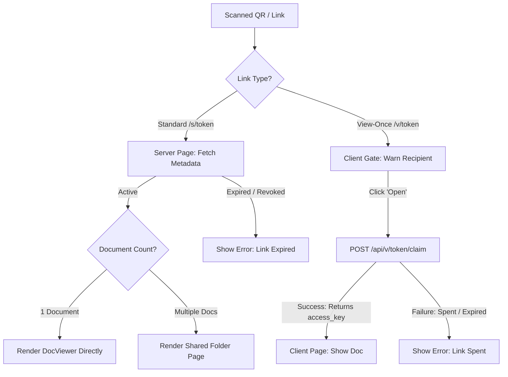

# INO — Personal Wealth & Secure Document Vault

INO is a secure, personal financial dashboard, wealth management, asset portfolio, and zero-knowledge document vault application. It allows users to scan and OCR government identity cards, track property valuations, manage investments and cards, calculate financial indicators (EMI, SIP, Gold), organize medical and general documents, store credentials with end-to-end encryption, and share documents securely via self-destructing ("View Once"), view-only, or password-protected QR links.

The ecosystem comprises two primary projects:
1. **Flutter Mobile Application** (Android & iOS) — The primary interface for secure uploads, biometric verification, E2E encryption, and OCR parsing.
2. **Next.js Web Frontend** (`share-frontend` on Vercel) — A thin, secure web portal hosting the recipient document viewer (individual/folder views).
3. **Supabase Backend** — Handles user authentication, database management (RLS-enforced per-user tables), Edge Functions (serving metadata and proxying files), and Storage.

---

## 📂 Core Tech Stack & Libraries

### 📱 Flutter App Dependencies
| Package | Role |
|---|---|
| `supabase_flutter` | Primary client for authentication, database synchronization, and storage. |
| `google_sign_in` | Google OAuth2 single sign-on integration. |
| `local_auth` / `local_auth_android` / `local_auth_darwin` | App lock and biometric verification (Face ID / Touch ID / Android BiometricPrompt). |
| `shared_preferences` | Local fast cache for settings, onboarding flags, and user-scoped metadata. |
| `cryptography` | Zero-knowledge client-side encryption (PBKDF2 key derivation and AES-GCM cipher). |
| `google_mlkit_document_scanner` | Native border detection, auto-cropping, and page deskewing for paper documents. |
| `google_mlkit_text_recognition` | On-device Optical Character Recognition (OCR) engine. |
| `camera` / `image_picker` / `image` | Camera streams, gallery importing, and raw image format manipulation. |
| `path_provider` / `open_filex` | Local caching of documents and routing to the operating system's native viewer (e.g., PDF/Word). |
| `pdf` | Pure-Dart document layout generation to export the ITR Tax Summary report. |
| `app_links` | Deep linking framework handling `/s/` and `/v/` links to open the app directly. |
| `qr_flutter` / `share_plus` | QR code generation and invocation of native OS sharing sheets. |
| `speech_to_text` / `flutter_tts` | Offline voice command keyword matching and text-to-speech voice feedback. |
| `firebase_core` / `firebase_messaging` / `flutter_local_notifications` | Push notification transport (FCM) and foreground notifications display wrapper. |

### 🌐 Next.js Web App Dependencies (`share-frontend`)
*   **Framework**: Next.js 14+ (App Router)
*   **PDF Renderer**: `react-pdf` (powered by pdf.js)
*   **Image Zoom**: `react-zoom-pan-pinch` (for pinch-to-zoom on mobile and scroll-to-zoom on desktop)
*   **Styling**: Vanilla CSS (highly responsive, light/dark mode compliant, custom transitions)

---

## 🏛️ Directory Structure & Key Files

```
INO/
├── lib/                             # Flutter Mobile Application
│   ├── config/                      # API / sharing base URL endpoints
│   ├── core/                        # UI responsiveness helpers
│   ├── l10n/                        # Localization delegates (EN, HI, TE, TA)
│   ├── models/                      # Wallet & Document data schemas
│   ├── providers/                   # State managers
│   ├── repositories/                # Data layers connecting local stores to Supabase
│   ├── screens/                     # UI screens grouped by feature
│   ├── services/                    # Background agents (OCR, E2E crypto, Deep Linking, Voice)
│   ├── theme/                       # Design tokens, color schemes, and fonts
│   └── widgets/                     # Reusable widgets (charts, buttons, cards)
├── share-frontend/                  # Next.js Web Portal (Vercel)
│   ├── app/                         
│   │   ├── s/[token]/               # Recipient entry, document preview and folder layouts
│   │   ├── api/s/[token]/file/      # Serverless API proxying document streams
│   │   └── globals.css              # Custom styling definitions
│   └── lib/                         # Next.js API client & types
└── supabase/                        # Database schemas & serverless functions
    ├── functions/                   # Supabase Edge Functions (e.g. `share`, `send-reminder-push`)
    └── migrations/                  # Idempotent DB schemas, RLS rules, and functions
```

---

## 🛠️ Key Features: User vs. Developer POV

### 1. Multi-Account Authentication & Biometric App Lock
*   **User POV**: 
    *   Sign in securely with Email/Password, Phone OTP, or Google.
    *   Save multiple accounts on the same device and toggle between them instantly via settings.
    *   Protect the entire app or specific folders with Face ID or fingerprint checks.
*   **Developer POV**:
    *   Wired via [auth_service.dart](file:///c:/Users/Lenovo/Downloads/BraveProjects/INO/lib/services/auth_service.dart).
    *   [account_switcher.dart](file:///c:/Users/Lenovo/Downloads/BraveProjects/INO/lib/services/account_switcher.dart) registers profiles in local storage. Switching profiles initiates a hot-swap of the active Supabase client session.
    *   `SessionReset` interceptor wipes all global caches, temporary paths, and sensitive user-scoped parameters on logout to block data leakage between accounts.
    *   [app_lock.dart](file:///c:/Users/Lenovo/Downloads/BraveProjects/INO/lib/screens/lock/app_lock.dart) sits at the root widget tree, catching app state transitions (`paused`/`resumed`) to prompt biometric checks via `local_auth`.

### 2. Intelligent Document Scanner & OCR Parser
*   **User POV**:
    *   Scan physical cards (Aadhaar, PAN, Driving License, Voter ID, Passport) or cash receipts.
    *   App auto-detects edges, corrects perspective distortion, and cleans up contrast.
    *   Extracted fields (like Name, Date of Birth, Document Number, Expiry, or Receipt Total) fill out form fields automatically.
*   **Developer POV**:
    *   Scanner leverages [document_scanner_service.dart](file:///c:/Users/Lenovo/Downloads/BraveProjects/INO/lib/services/document_scanner_service.dart) and ML Kit.
    *   OCR values processed by [ocr_service.dart](file:///c:/Users/Lenovo/Downloads/BraveProjects/INO/lib/services/ocr_service.dart).
    *   Specialized on-device parser modules ([aadhaar_parser.dart](file:///c:/Users/Lenovo/Downloads/BraveProjects/INO/lib/services/aadhaar_parser.dart), `pan_parser.dart`, etc.) clean noisy text using fuzzy string matching (Levenshtein distance), regex filters, and localized date parsers to handle folds, poor lighting, or typos.

### 3. Unified Wallet Storage & Dynamic Schema
*   **User POV**:
    *   Sort files and metrics into wallets: **Identity, Documents, Property, Insurance, Health, Investments, Banking, Cards,** or **Passwords**.
    *   Create custom wallets (e.g. "My Pets") with custom icons and color schemes.
    *   All documents, metadata, and folders update across devices instantly.
*   **Developer POV**:
    *   Instead of a single monolithic table, every wallet has its own Postgres table (`public.w_identity_wallet`, `public.w_property_wallet`, etc.).
    *   Custom wallets invoke `public.create_custom_wallet()`, which dynamically generates a new table `public.w_<slug>` and rebuilds a unified read-only `public.documents` database view (via `union all`).
    *   `LocalCollectionStore` coordinates synchronisation. Data caches locally under `shared_preferences` first, updating to Supabase under a "last-write-wins" policy.

### 4. Zero-Knowledge E2E Encrypted Password Vault
*   **User POV**:
    *   Save passwords, usernames, and secret credentials securely.
    *   Set a master passphrase during setup. If lost, the data is permanently unrecoverable.
    *   Credentials show as encrypted tokens until unlocked on-device.
*   **Developer POV**:
    *   Controlled by [vault_crypto.dart](file:///c:/Users/Lenovo/Downloads/BraveProjects/INO/lib/services/vault_crypto.dart).
    *   The master passphrase is fed into PBKDF2-HMAC-SHA256 (210,000 iterations + a per-user salt stored in `public.vault_keys`) to generate a 256-bit key on the fly.
    *   The secret password payload is encrypted locally using AES-GCM (`cryptography` package). The cipher text is sent to the `w_password_vault` table. Plaintext passwords *never* leave the device.

### 5. Multi-Mode QR Document Sharing (Standard vs. View-Once)
*   **User POV**:
    *   Generate a share link or QR code for one or multiple items.
    *   **Standard Share**: Open in browser or app. Can be expired, revoked, or password protected.
    *   **View-Once Share**: Recipient can open the document exactly once. The link immediately self-destructs. The sender's app displays a live indicator showing if it has been opened.
    *   **View-Only**: The recipient can read the document in the web viewer but cannot download the raw file.
*   **Developer POV**:
    *   Standard sharing maps to `/s/[token]` route. View-Once sharing maps to `/v/[token]` route.
    *   **View Once Gate**: The token-burning mechanism is atomic SQL executed inside the Edge Function:
        ```sql
        UPDATE public.view_once_shares
        SET viewed = true, viewed_at = now(),
            access_key = gen_random_uuid(), access_expires_at = now() + interval '5 minutes'
        WHERE token = p_token AND viewed = false AND revoked = false AND expiry_time > now()
        RETURNING *;
        ```
    *   A unique short-lived `access_key` is generated upon a successful claim. The web client uses this key to request the file stream; after 5 minutes, the access key expires, preventing subsequent reads even if the browser remains open.
    *   **Screenshot Protection**:
        *   **Android**: MethodChannel `ino/secure_screen` invokes native `FLAG_SECURE` layout flags on the window, blocking screenshots, screen records, and task thumbnails.
        *   **iOS**: Observes `capturedDidChangeNotification` to hide content when a screen recording is active, and listens to `userDidTakeScreenshotNotification` to warn the owner.
        *   **Web**: Deterrents like right-click and text-selection blocks are implemented.

### 6. Property Portfolios & Calculators
*   **User POV**:
    *   Input real estate portfolios, co-owners, purchasing price, tax data, rental metrics, and outstanding home loans.
    *   Compute mortgages, SIP goals, live gold valuations, and exchange rates.
*   **Developer POV**:
    *   Property inputs maps to `w_property_wallet` in Supabase.
    *   Calculators operate offline using custom algorithms in `sip_calculator_service.dart` and `emi_calculator_service.dart`.
    *   Live rates connect to metals APIs via `gold_price_service.dart`.

### 7. Tax summary PDF Export
*   **User POV**:
    *   Aggregate expenses and category documents (e.g. invoices, receipts) to export a formatted Tax Summary PDF for tax filing (ITR).
*   **Developer POV**:
    *   `tax_summary_pdf.dart` compiles local wallet metadata, draws an official layout grid, writes the binary file to temporary storage via `path_provider`, and invokes `share_plus` or `open_filex`.

### 8. Hands-Free Voice Commands
*   **User POV**:
    *   Tap the microphone and command the app to navigate (e.g., "Go to Health", "Open Password Vault").
*   **Developer POV**:
    *   Speech-to-text listens on-device. Key words are matched using regular expressions inside [voice_nav.dart](file:///c:/Users/Lenovo/Downloads/BraveProjects/INO/lib/services/voice_nav.dart) and execute programmatically via the global `NavigatorState` key.

---

## 💻 Web Frontend Developer Implementation Guide

The Next.js web application (`share-frontend`) serves as the recipient viewer. Frontend developers rebuilding or extending this UI should refer to the following routes, API proxies, and payloads.

### 🧭 Page Routing Strategy
*   `GET /s/[token]` - Standard sharing gateway. Resolves one or multiple documents.
*   `GET /v/[token]` - View-Once sharing gateway. Displays a warning screen before letting the recipient click "Open" (to prevent bots, link crawlers, or notification builders from burning the link automatically).



### 📡 API Contracts

#### 1. Fetch Share Metadata
When loading a share page, the server-side Next.js route fetches metadata from the Edge Function (avoiding exposure of the Supabase database to the client).

*   **Endpoint**: `GET <SUPABASE_FUNCTIONS_URL>/share/<token>?format=json`
*   **Response Payload**:
    ```json
    {
      "status": "active",
      "shareId": "share_9a2b8c...",
      "count": 2,
      "expiresAt": "2026-08-05T12:00:00.000Z",
      "passwordProtected": false,
      "viewOnly": true,
      "documents": [
        {
          "index": 0,
          "name": "Aadhaar_Card.jpg",
          "type": "Shared copy",
          "kind": "image",
          "mime": "image/jpeg"
        },
        {
          "index": 1,
          "name": "Tax_Form_16.pdf",
          "type": "Shared copy",
          "kind": "pdf",
          "mime": "application/pdf"
        }
      ]
    }
    ```

#### 2. Claim View-Once Share
Claiming is a `POST` operation. The request burns the view-once token and returns a short-lived key for file viewing.

*   **Endpoint**: `POST /api/v/[token]/claim`
*   **Request Payload**: `{ "ip_hash": "sha256_hash_of_client_ip" }`
*   **Response Payload (Success)**:
    ```json
    {
      "success": true,
      "accessKey": "temp_key_d92f81...",
      "expiresAt": "2026-07-29T12:15:00.000Z"
    }
    ```
*   **Response Payload (Spent / Expired)**:
    ```json
    {
      "success": false,
      "error": "This document has already been viewed or has expired."
    }
    ```

#### 3. Stream File Bytes
To serve document bytes without exposing signed Supabase Storage URLs to the client, the Next.js API acts as a proxy stream.

*   **Endpoint (Standard)**: `GET /api/s/[token]/file/[index]?mode=view|download`
*   **Endpoint (View-Once)**: `GET /api/v/[token]/file?k=[accessKey]`
*   **Parameters**:
    *   `mode=view`: Returns header `Content-Disposition: inline`.
    *   `mode=download`: Returns header `Content-Disposition: attachment; filename="..."` (blocked if `viewOnly: true` is configured).
*   **Proxy Logic**: The Next.js API calls the Supabase Edge Function with the service key, captures the byte stream, and pipe-writes it back to the browser.

---

## 🔒 Security and Data Isolation Policies

Ensure all updates respect these design rules:

> [!IMPORTANT]
> **Owner Scoping**: Every database query in the app must append the `.eq('auth_user_id', uid)` filter. Row Level Security (RLS) is enabled database-wide, but explicit client filters prevent database query caching bleed-through on single-device multi-account handoffs.

> [!WARNING]
> **No Raw Storage Exposure**: Never expose storage paths (e.g. `bucket/folder/file.pdf`) or Supabase client access keys in URLs. All files accessed anonymously must be proxied via the Next.js API or Supabase Edge Functions.

> [!CAUTION]
> **Password Cryptography**: Never store or transmit the user's master passphrase. Do not store passwords in plaintext columns. Only encrypt the secret password payload on-device using PBKDF2/AES-GCM; database values must look like base64-encoded cipher text.

---

## 🚀 Backend Deployment Setup

Follow these steps to deploy the database migrations, Edge Functions, and Next.js frontend.

### 1. Database Migrations
Deploy the idempotent SQL schemas (which set up wallets, document sharing, and encryption keys):
```bash
supabase db push
```

### 2. Configure Firebase Cloud Messaging (FCM)
1. Go to the **Firebase Console** → Project Settings → Service Accounts.
2. Click **Generate new private key** and download the JSON file.
3. Set the key inside Supabase Secrets (do not commit this JSON):
```bash
supabase secrets set FCM_SERVICE_ACCOUNT="$(cat ~/Downloads/your-firebase-key.json)"
```

### 3. Deploy Edge Functions
Deploy the serverless routes executing the share queries and sending notifications:
```bash
supabase functions deploy share --no-verify-jwt
supabase functions deploy send-reminder-push
```

### 4. Deploy Next.js Web Portal (Vercel)
1. Link Vercel to the `share-frontend` folder.
2. Set the Environment Variable:
   *   `SUPABASE_FUNCTIONS_URL` = `https://<your-supabase-project-ref>.functions.supabase.co`
3. **Optional** — link a custom domain in Vercel. There is no custom domain today:
   `share.inoapp.in` appears in older notes but does **not** resolve (NXDOMAIN),
   so do not use it in tests or docs until it is actually configured. The live
   base is the Vercel URL, and [share_config.dart](lib/config/share_config.dart)
   already points `publicBase` at it — change that one constant and every new
   QR/link follows.

---

## 🧪 Testing and Verification Protocols

Verify that features work correctly using these command line triggers:

### 1. Run Automated Unit and Integration Tests
```bash
# Runs the full test suite, including duplicate-account isolation and E2E encryption ciphers
flutter test
```

### 2. Verify View-Once Web Endpoints
```bash
# Use the live Vercel base - share.inoapp.in does not resolve.

# 1. Check share status (Non-destructive Peek)
curl -s "https://ino-share-web.vercel.app/s/<token>?format=json"

# 3. Claim token (Burns link, returns accessKey)
curl -s -X POST "https://ino-share-web.vercel.app/api/v/<token>/claim"

# 4. Requesting claim again must fail (HTTP 410 Gone / 401 Unauthorized)
curl -s -i -X POST "https://ino-share-web.vercel.app/api/v/<token>/claim"
```
